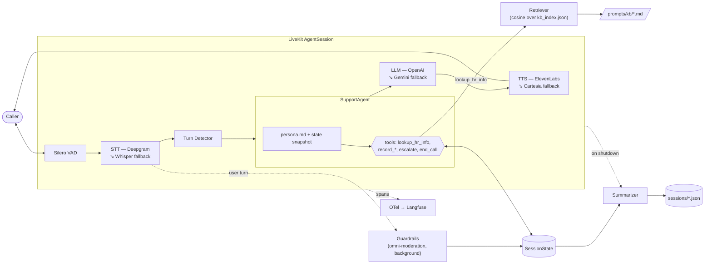

# cs-voice

Voice HR agent for Orbio. Mar takes calls from employees, answers common HR
questions from a knowledge base, and collects + routes anything that needs a
person.

## Stack

- **LiveKit Agents** — voice loop, WebRTC, turn detection
- **Deepgram Nova-3** — multilingual STT
- **ElevenLabs Multilingual v2** — TTS
- **OpenAI** — LLM (`gpt-5.4-mini`) + embeddings (`text-embedding-3-small`)
- **Silero VAD** + LiveKit **audio turn detector**

## Layout

```
src/cs_voice/
  main.py         entrypoint, wires plugins + session, loads retriever
  agent.py        SupportAgent + tools (lookup_hr_info, slot recording)
  rag.py          KB chunking, embedding, cached index, retriever
  state.py        Slot, SessionState, enums
  parsing.py      deterministic value parsers (employee ID)
  guardrails.py   input moderation (OpenAI omni-moderation)
  summarizer.py   end-of-call LLM summary (Pydantic CallSummary)
  persistence.py  per-session JSON sink (state + transcript + summary)
  tracing.py      OpenTelemetry → Langfuse wiring (opt-in)
  config.py       typed settings (pydantic-settings)
  prompts/        persona.md, prompt loader
  prompts/kb/     HR knowledge base (markdown) + cached kb_index.json
tests/            pytest, unit + retrieval eval + opt-in behavioral evals
sessions/         gitignored runtime dumps
```

## How it works



Each call runs the LiveKit voice loop (VAD → STT → turn detection → LLM → TTS).
`SupportAgent` drives the conversation through `persona.md` and a set of tools.

Mar triages every call into **answer** vs **route**:

- **Answer** — for a general HR question she calls `lookup_hr_info`, which
  embeds the question and does cosine search over the knowledge base. If the top
  match clears the similarity threshold she answers from it and cites the source;
  no employee ID needed.
- **Route** — for an issue (or when the lookup finds nothing) she collects four
  slots — employee ID, category, description, urgency — and hands off. The
  employee ID uses a deterministic parser + two-step readback/confirm. Urgency is
  inferred, never read out as a "low/medium/high" menu.

When a lookup misses, the question already gave her the description and category,
so the pivot to routing only asks for what's still missing.

### Knowledge base / RAG

`rag.py` chunks each KB doc by `##` section, embeds the chunks once, and caches
the vectors to `prompts/kb_index.json` keyed by a content hash — so the index
rebuilds only when the KB changes. Search is in-memory cosine; `best()` applies
`THRESHOLD` and returns `None` below it, which is the agent's "don't invent,
route instead" signal.

```bash
uv run python -m cs_voice.rag        # (re)build the cached index
uv run pytest tests/test_retrieval.py # offline chunking + Q->source eval
```

Future improvements: a retrieval eval set (labelled question → expected source)
to pick the similarity threshold from data instead of by feel; swap the in-memory
index for a vector DB (pgvector / Pinecone) once the KB outgrows a few hundred
chunks — the `Retriever` protocol is the seam; stronger chunking once sources
diverge in shape (PDFs, Notion exports, tables) — semantic / layout-aware splitting
instead of `##` sections; query embedding cache (LRU on the normalized question)
so repeat FAQs skip the embedding round-trip; and a proper ingestion pipeline
(worker + queue, dedup, incremental re-embed on source change) once the KB is
updated by non-engineers.

### Summary & persistence

When the call ends, `summarizer.py` sends the user/assistant turns plus the
final `SessionState` snapshot to the LLM and parses a Pydantic `CallSummary`
(headline, key points, next action, sentiment, resolved). `persistence.py`
writes one JSON file per call to `sessions/` with the state, transcript, and
summary. The summary call is bounded by a 10s timeout so a slow LLM can't
eat the shutdown drain window.

The state snapshot is treated as ground truth in the prompt; the transcript
is for color and tone. Tool calls are filtered out before sending — they're
noise for a human reader.

Future improvements: pin summary output to a consistent ops language and persist the detected call language,
retry or degrade to a state-only fallback on LLM failure / timeout instead of dropping the summary,
an LLM-judge eval over canned transcripts to catch prompt drift, and a schema version on persisted JSON.

## Design decisions

- **Answer + route, not just intake.** Most HR calls are FAQs; answering them on
  the call deflects tickets and only routes what needs a human.
- **No vector DB.** A few dozen chunks fit in memory; cosine is microseconds. The
  `Retriever` protocol is the one deliberate abstraction — the seam to swap in
  pgvector/Pinecone when the KB outgrows memory.
- **Committed index.** The eval and CI run offline; embedding the KB is a build
  step, not a startup dependency.
- **Async-first retrieval.** The live agent is the primary caller, so `rag.py`
  uses `AsyncOpenAI` throughout.
- **Deterministic ID parsing** over asking the LLM to transcribe digits — voice
  gets digits wrong, so parse + read back + confirm.
- **Fallback providers for STT / LLM / TTS.** Each pipeline stage is wrapped in
  LiveKit's `FallbackAdapter` so a single vendor blip doesn't kill a live call.
  Secondaries (Whisper, Gemini Flash Lite, Cartesia) are only attached when their
  keys are set, so a minimal `.env` still boots.
- **Latency-first voice loop.** `preemptive_generation=True` lets the LLM start
  drafting while the user is still finishing; the `turn_detection` model decides
  end-of-turn (not just VAD silence) so barge-in feels natural; moderation runs
  fire-and-forget in the background so a ~150–500ms round-trip doesn't gate the
  reply. Background thinking / ambient audio masks the residual gap. VAD weights
  and the RAG index load in `prewarm_fnc` (once per worker subprocess) so they're
  off the call's critical path; the prewarm duration is logged.
- **State as ground truth, transcript as color.** The persona reads from a
  rendered `SessionState` snapshot appended to its instructions every turn,
  rather than re-deriving slots from the chat log. Same idea at summary time.
  Cheaper, deterministic, survives long calls.
- **Observability via OpenTelemetry → Langfuse.** LiveKit already emits spans
  for STT/LLM/TTS/turns/tools; we ship them to a self-hosted Langfuse grouped by
  `session.id`. Opt-in: unset keys = no tracing, no startup cost.
- **Audio metrics collected, not yet dashboarded.** LiveKit exposes per-turn
  latency / interruption / VAD metrics on the session event bus. Wiring them
  into a Grafana board was cut for time — the data is there, the panel isn't.

## Guardrails

Three layers, each with one enforcement point:

- **Input moderation** — every user turn runs through OpenAI's
  `omni-moderation-latest` in `guardrails.py`. A flag sets `state.escalated = True`;
  the persona's escalation branch then routes Mar to a polite handoff and `end_call`.
  Fails open on API error so an outage never kills a live call.
- **Scope / escalation** — out-of-scope topics (legal advice, medical diagnosis,
  harassment investigation, anything naming another employee) are handled in the
  persona via the existing `escalate(reason)` tool.
- **Hallucination** — the RAG similarity threshold in `rag.py` returns `None`
  below the cutoff, which the persona reads as "don't invent, route instead."

Future improvements: prompt-injection / jailbreak detection, per-category moderation thresholds instead of the binary
`flagged`, and policy-compliance evals on agent output.

## Setup

```bash
make install
cp .env.example .env   # fill in keys
uv run cs-voice download-files   # one-time: VAD + turn-detector weights
```

LiveKit Cloud project for URL/key/secret. API keys from OpenAI, Deepgram,
ElevenLabs.

## Run

```bash
make run
```

Then open the [LiveKit Agents Playground](https://agents-playground.livekit.io),
connect to your project, and talk to it.

## Develop

```bash
make test     # pytest (offline; behavioral evals are opt-in: `uv run pytest -m eval`)
make lint     # ruff + mypy
make format   # ruff format + autofix
```

## Observability

Three layers, in order of how often you'll reach for them.

### Tracing — Langfuse (opt-in)

The agent emits OpenTelemetry spans (STT / LLM / TTS, tool calls, turns) which we ship to
a locally self-hosted Langfuse, grouped by session id. Disabled until you set the keys.

```bash
make langfuse                      # start the local Langfuse stack (UI at localhost:3000)
```

In the UI: create an account → a project → copy the public/secret keys into `.env`
(`LANGFUSE_PUBLIC_KEY`, `LANGFUSE_SECRET_KEY`; `LANGFUSE_HOST` defaults to `localhost:3000`).
Confirm the plumbing without placing a call:

```bash
uv run python -m cs_voice.tracing  # emits one test span → check the UI
```

After that, `make run` traces every call. Leave the keys unset to disable.
`docker-compose.langfuse.yml` is Langfuse's official self-host compose, vendored
and pinned to their `:3` images.

### Per-call JSON dumps

`sessions/<session_id>.json` is written on shutdown with the final `SessionState`,
the full transcript, and the `CallSummary`. This is the audit trail — grep here
when a call goes sideways, and the same files double as fixtures for the
behavioral evals.

### Audio metrics — captured, not dashboarded

LiveKit emits per-turn latency, interruption, and VAD events on the session
event bus. We don't subscribe yet — the data is there, the panel isn't. Next
step is a small collector → Prometheus → Grafana board for end-to-end latency,
barge-in rate, and turn-detector confidence.

Future improvements: structured logging (JSON to stdout, session_id on every
record) so traces / logs / metrics share a correlation key; a Prometheus
exporter for the LiveKit metrics above plus app counters (slots filled,
escalations, lookup hit-rate); SLOs and alerts on p95 turn latency and
fallback-provider activation; PII scrubbing on transcripts before they hit
Langfuse.
